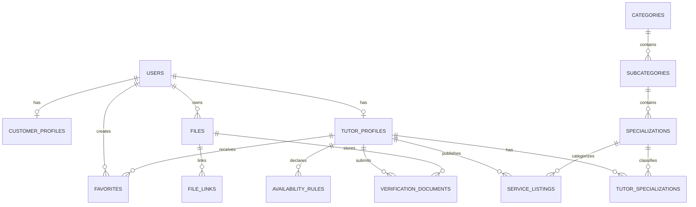

# TutorLink foundation ERD handover

The executable source of truth is the Laravel migration set in
`backend/database/migrations`. The full domain schema and constraints are
documented in [w1-a1-database-schema.md](./w1-a1-database-schema.md).

This focused ERD covers the Issue 1 foundation domains: Identity, Files, and
Marketplace Listings.

## Foundation invariants

- `users.id` and all foreign keys are opaque positive `bigint` identifiers.
- User roles are `customer`, `tutor`, or `admin`; account status is server-owned.
- Passwords are stored in `users.password_hash`, never in API payloads.
- Files store object-storage metadata only; binary content does not go in PostgreSQL.
- `files.object_key` is unique and ownership is required.
- A listing is publishable only after its tutor profile is approved; this is a
  service-layer transaction rule, not a client-controlled status change.
- Listing prices use integer minor units plus an ISO-4217 currency code.
- PostgreSQL is the source of truth for production-like local validation.
