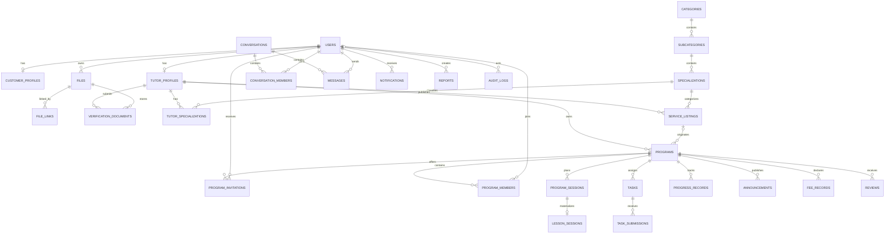

# W1-A1 — TutorLink database schema

**Ticket:** TL-XXX  
**Type:** Database / Architecture  
**Database:** PostgreSQL 16  
**Backend:** Laravel 13  
**Status:** Implemented, pending team review  
**Related contract:** [`W1-C1 — Business state policy and contracts`](../contracts/w1-c1-business-contracts.md)

## 1. Issue goal

Create the first executable database schema for TutorLink so backend, frontend,
and QA can implement against one shared data contract. The schema covers the
MVP domains described in the system design:

- identity and tutor approval;
- catalog and marketplace;
- direct/program messaging;
- private tutoring programs, invitations, membership, schedules, tasks, and
  progress;
- files, announcements, declared fees, reviews, notifications, reports, and
  audit history.

This issue owns the schema and database constraints. It does not implement API
endpoints, authorization policies, state-transition services, object storage,
queues, or UI.

## 2. Design decisions

1. All primary keys use Laravel `bigint` identifiers. IDs are opaque to clients.
2. PostgreSQL is the source-of-truth database. Business `CHECK` constraints and
   partial unique indexes are installed when the active driver is PostgreSQL.
3. Money is stored as an integer minor amount plus a three-letter ISO-4217
   currency code, for example `15000000` + `VND`. Floating-point money is not
   allowed.
4. Business timestamps use timezone-aware columns and API timestamps must be
   returned in UTC. Schedule rows also keep the IANA timezone used to display
   local time.
5. `programs` and `program_invitations` store offer snapshots. Once
   `snapshot_locked_at` is set or an invitation is created, application code
   must not mutate the commercial/identity snapshot.
6. Laravel already owns the `sessions` table for HTTP sessions. TutorLink uses
   `program_sessions` for planned lessons and `lesson_sessions` for actual
   teaching occurrences.
7. Files stay in object storage. The database stores ownership, object key,
   MIME, size, visibility, checksum, scan state, and links to business records.
8. Historical business records use restrictive foreign keys. Cascading delete
   is limited to replaceable children such as join rows and draft-like profile
   data. User deletion is soft deletion.
9. Derived states are not stored. In particular, a Task is overdue when
   `due_at < now()` and its persisted status is not a terminal status.
10. Polymorphic references in `file_links`, `reports`, and `audit_logs` use an
    allow-listed `resource_type`. Authorization and resource existence remain
    service-layer responsibilities.

## 3. Core domain map

## 4. Table contract

### 4.1 Identity and files

| Table | Purpose | Key constraints |
| --- | --- | --- |
| `users` | Login identity and fixed MVP role. | Unique email; role/status checks; soft delete; renamed `full_name` and `password_hash`. |
| `customer_profiles` | Public/private customer profile data. | One row per user; optional avatar file. |
| `tutor_profiles` | Tutor provider identity and approval state. | One row per user; approval state uses the W1-C1 vocabulary. |
| `verification_documents` | Private tutor evidence. | Unique tutor/file pair; reviewer and decision timestamps retained. |
| `files` | Object-storage metadata. | Unique `object_key`; non-binary metadata only; owner is required. |
| `file_links` | Attachments for supported resources. | Unique file/resource link; resource type allow-list. |

`customer_profiles.user_id` must reference a `customer` user and
`tutor_profiles.user_id` must reference a `tutor` user. PostgreSQL cannot express
that cross-table role rule as a normal `CHECK`; the command service must validate
it in the same transaction that creates the profile. The same service must
enforce the MVP age rule (Customer and Tutor are at least 18 on the relevant
business date); age is intentionally not stored as a derived column.

### 4.2 Catalog and marketplace

| Table | Purpose | Key constraints |
| --- | --- | --- |
| `categories` | Top-level subject grouping. | Global unique slug; active/inactive state. |
| `subcategories` | Category child. | Unique `(category_id, slug)`. |
| `specializations` | Searchable tutor skill. | Unique `(subcategory_id, slug)`. |
| `tutor_specializations` | Tutor-to-skill join. | Composite primary key prevents duplicates. |
| `service_listings` | Public tutor service offer. | Unique slug; integer price; marketplace compound index. |
| `availability_rules` | Informational recurring availability. | Weekday 0–6; `end_time > start_time`; does not reserve a slot. |
| `favorites` | User-saved tutor. | Composite primary key `(user_id, tutor_profile_id)`. |

A listing may become `active` only if its tutor profile is `active` (approved).
This is a transactional service rule because it depends on another row.

### 4.3 Messaging

| Table | Purpose | Key constraints |
| --- | --- | --- |
| `conversations` | Direct or Program-scoped conversation. | Unique `direct_key`; direct rows require a key; no `rejected` state. |
| `conversation_members` | Participant and read cursor. | Unique conversation/user pair; read message is a nullable FK. |
| `messages` | Ordered message event. | Unique `(sender_id, client_message_id)` makes retries idempotent; conversation/time index. |

For direct messages, the backend must derive `direct_key` from sorted participant
IDs and context instead of trusting client input.

### 4.4 Programs and learning

| Table | Purpose | Key constraints |
| --- | --- | --- |
| `programs` | Private tutor/customer agreement. | Versioned offer snapshot; W1-C1 states; owner/status index. |
| `program_invitations` | Immutable offer delivered to a customer. | Idempotency key; expiry; one pending invitation per program/version/invitee. |
| `program_members` | Accepted Program membership. | Unique program/user; at most one active Customer member in MVP. |
| `program_sessions` | Planned occurrence under a Program version. | Unique sequence within version; end after start. |
| `lesson_sessions` | Actual occurrence and completion evidence. | Exactly zero or one actual occurrence per planned row. |
| `tasks` | Program assignment. | Due/status index; overdue is calculated, not stored. |
| `task_submissions` | Current Customer answer. | One current submission per Task/Customer in MVP. |
| `progress_records` | Tutor-recorded metric history. | Indexed by Program, Customer, and record time. |

`program_sessions` are plans and must never be counted as delivered lessons.
Attendance, completion, progress, and later billing calculations use
`lesson_sessions`.

### 4.5 Operations and trust

| Table | Purpose | Key constraints |
| --- | --- | --- |
| `announcements` | Program announcement. | Program/publish-time index. |
| `fee_records` | Declared fee for a period. | Unique Program/period start; integer amount; valid date range. |
| `reviews` | Customer review after Program completion. | Unique Program/reviewer; rating 1–5. |
| `notifications` | Minimal in-app delivery payload. | UUID primary key; user/read/time index. |
| `reports` | Moderation report for an allow-listed resource. | Status and resource lookup indexes. |
| `audit_logs` | Append-only administrative/business event. | Actor/resource/time indexes; before/after JSON; request correlation ID. |

The application must not expose update/delete endpoints for `audit_logs`.
Database retention/partitioning can be introduced after real volume is known.

## 5. Required transaction boundaries

### Accept Program invitation

One transaction must:

1. lock the invitation and Program rows (`SELECT ... FOR UPDATE`);
2. verify actor, `pending` status, `expires_at`, Program version, active Customer,
   approved Tutor, and unchanged snapshot;
3. transition invitation to `active` and set response/acceptance timestamps;
4. insert the Customer `program_members` row;
5. transition the Program to `active` when all gates pass;
6. append the audit event;
7. enqueue notification/email through an outbox or after-commit queue callback.

The partial indexes ensure that concurrent requests cannot create two pending
invitations or two active Customer members. Row locks ensure only one response
wins.

### Publish listing

Lock the Listing and Tutor Profile, then verify tutor approval and active account
before changing the Listing to `active`.

### Create direct conversation

Derive and lock the natural `direct_key`; validate both members and relationship;
then find-or-create and activate the Conversation atomically.

### Review Tutor

Lock the Tutor Profile, verify reviewer permission/current state, write the new
approval state and review timestamps, and append an audit event in one
transaction.

## 6. Migration layout

| Migration | Scope |
| --- | --- |
| `2026_10_07_000100_extend_users_and_create_files_table.php` | User identity contract, soft delete, file metadata. |
| `2026_10_07_000200_create_identity_and_catalog_tables.php` | Profiles, verification, taxonomy, listings, availability, favorites. |
| `2026_10_07_000300_create_messaging_tables.php` | Conversations, members, messages, retry/read constraints. |
| `2026_10_07_000400_create_program_and_learning_tables.php` | Program snapshot, invitation/member rules, planned/actual lessons, Tasks, progress. |
| `2026_10_07_000500_create_operations_and_trust_tables.php` | Announcements, fee declarations, reviews, attachments, notifications, reports, audit. |

## 7. Acceptance criteria

- [x] Every table in system-design Section 7 has an executable migration.
- [x] Laravel HTTP `sessions` and learning sessions are unambiguous.
- [x] Foreign keys prevent orphaned core records.
- [x] Unique constraints cover profile, membership, favorite, review, and message retry duplication.
- [x] PostgreSQL partial unique indexes cover pending invitations and the MVP one-Customer rule.
- [x] Program and invitation snapshots are represented explicitly.
- [x] Marketplace, messages, schedules, Tasks, notifications, and audit lookup indexes exist.
- [x] Money avoids floating point.
- [x] A schema test verifies the table set and critical columns.
- [ ] Team review confirms names, state vocabulary, and file-policy limits.
- [ ] API/service issues implement authorization, transitions, locks, snapshot immutability, and after-commit delivery.

## 8. Review checklist for the team

Before treating W1-A1 as frozen, confirm:

1. MVP account roles are exactly `customer`, `tutor`, and `admin`.
2. `VND` is stored as an integer minor unit consistently in API documentation.
3. The one-active-Customer-per-Program restriction matches the product plan.
4. `lesson_sessions` is accepted as the final name for delivered lessons.
5. File MIME/size policy in W1-C1 is approved and runtime upload limits are
   changed in a separate infrastructure issue.
6. Whether Program offer edits create a new row or increment `programs.version`;
   until resolved, code must never overwrite a locked snapshot.
7. The source design says Reviews require a `Completed` Program, while W1-C1 has
   no `completed` Program state. Until the vocabulary is resolved, review
   creation must require completion evidence from `lesson_sessions` and a
   terminal Program; the API must not invent a new state independently.
